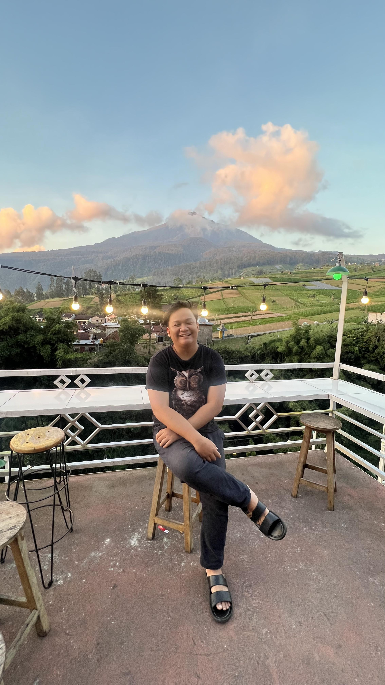

# Project 
## Hamburger Killer

Selamat datang di proyek Hamburger Killer! Proyek ini adalah sebuah halaman web sederhana untuk sebuah toko burger yang menampilkan menu, informasi tentang kami, dan formulir kontak.

## Daftar Isi

- [Deskripsi](#deskripsi)
- [Struktur Proyek](#struktur-proyek)
- [Fitur](#fitur)
- [Cara Menggunakan](#cara-menggunakan)
- [Kontribusi](#kontribusi)

## Deskripsi

Hamburger Killer adalah proyek halaman web statis yang menampilkan berbagai jenis hamburger yang kami tawarkan. Halaman ini juga mencakup bagian tentang kami dan formulir kontak untuk pengunjung yang ingin menghubungi kami.

## Struktur Proyek

hamburger-killer/
├── index.html
├── assets/
│ ├── hamburger1.jpg
│ ├── hamburger2.jpg
│ └── hamburger3.jpg
└── README.md

## Link Netlify: https://hamburgerkill.netlify.app/


- `index.html`: Berkas utama yang berisi kode HTML untuk halaman web.
- `assets/`: Direktori yang berisi gambar-gambar hamburger yang digunakan di halaman web.

## Fitur

- **Navigasi**: Terdapat navbar dengan tautan ke bagian Home, About, Menu, dan Contact.
- **Header**: Judul selamat datang di toko burger.
- **Menu**: Tiga jenis burger dengan gambar dan deskripsi.
- **About Us**: Informasi tentang toko burger.
- **Contact Form**: Formulir kontak untuk pengunjung.

## Cara Menggunakan

1. **Clone repositori ini**:

    ```sh
    git clone https://github.com/username/hamburger-killer.git
    ```

2. **Buka berkas `index.html`** di peramban web pilihan Anda:

    ```sh
    cd hamburger-killer
    open index.html
    ```

## Kontribusi

Kami sangat terbuka terhadap kontribusi! Jika Anda memiliki saran atau perbaikan, silakan buat pull request atau buka issue di repositori ini.

1. Fork repositori ini.
2. Buat branch baru: `git checkout -b fitur-baru`.
3. Commit perubahan Anda: `git commit -m 'Menambahkan fitur baru'`.
4. Push ke branch: `git push origin fitur-baru`.
5. Buat pull request.


# About Me

### Hi there 👋, I'm Satria


 -->

## I Love Cats 🐱

> **Fun Fact**: I think I am funny 😄

📫 How to reach me: **satrialimpad@gmail.com**

### Connect with Me

[](https://linkedin.com/in/satrialimpad)
[](https://discord.gg/#8444)

### GitHub Stats

<p>
  
  
</p>